# Assignment 2 Demo

## Classification Demo
### Original Class File
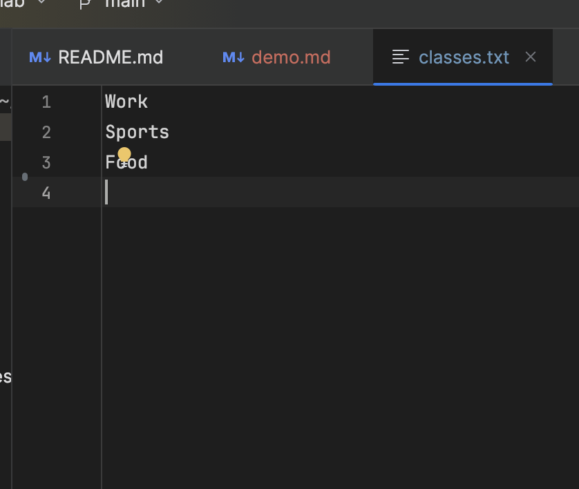
### App Running
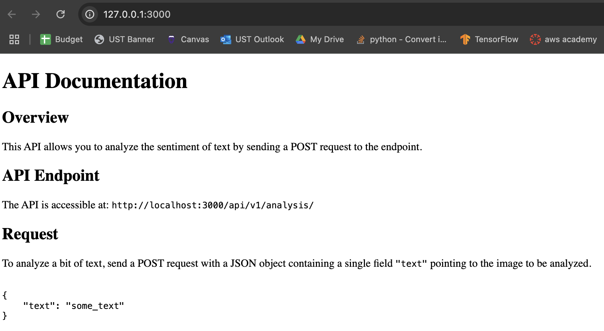
### Add list of classes with POST endpoint (`/add-classes`)
#### Additional GET endpoint to fetch the classes (`/classes`)
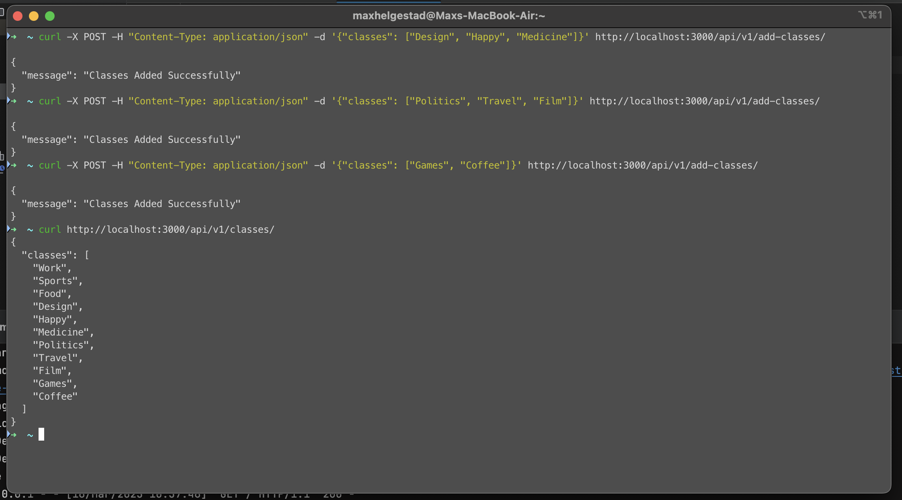
### Text file after `/add-classes` call
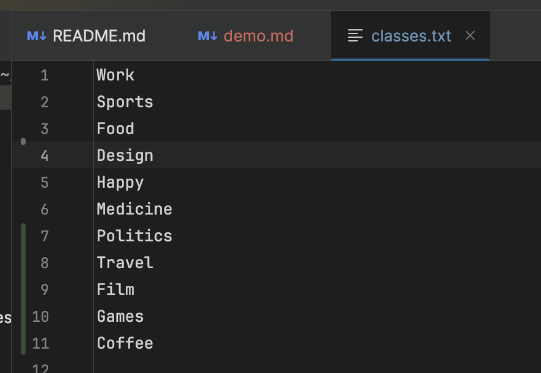
### Any Classes that already exist will not be added twice
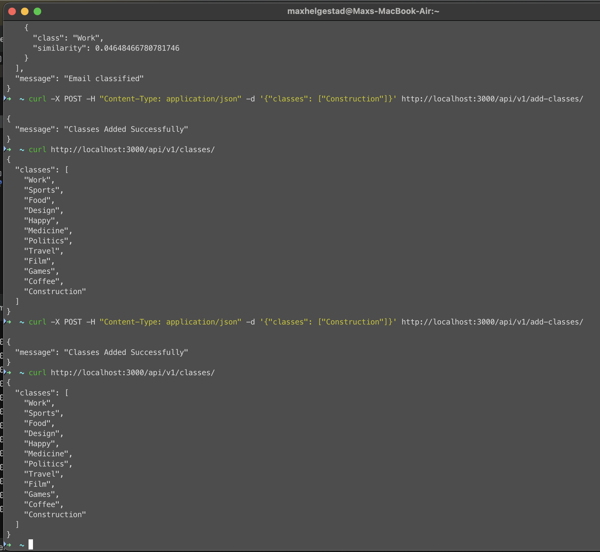
### Classification Examples
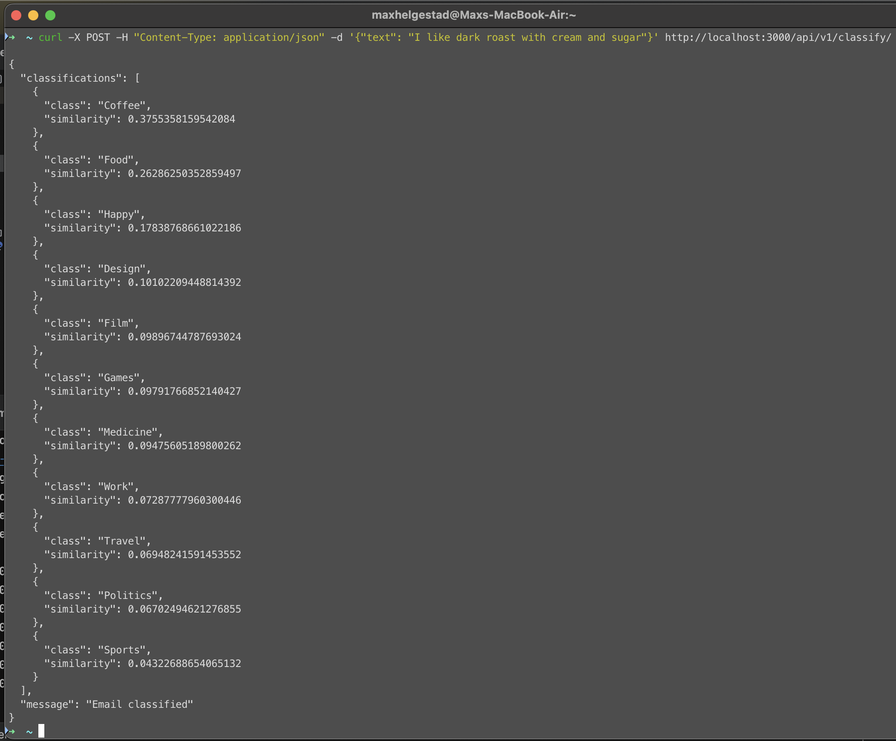
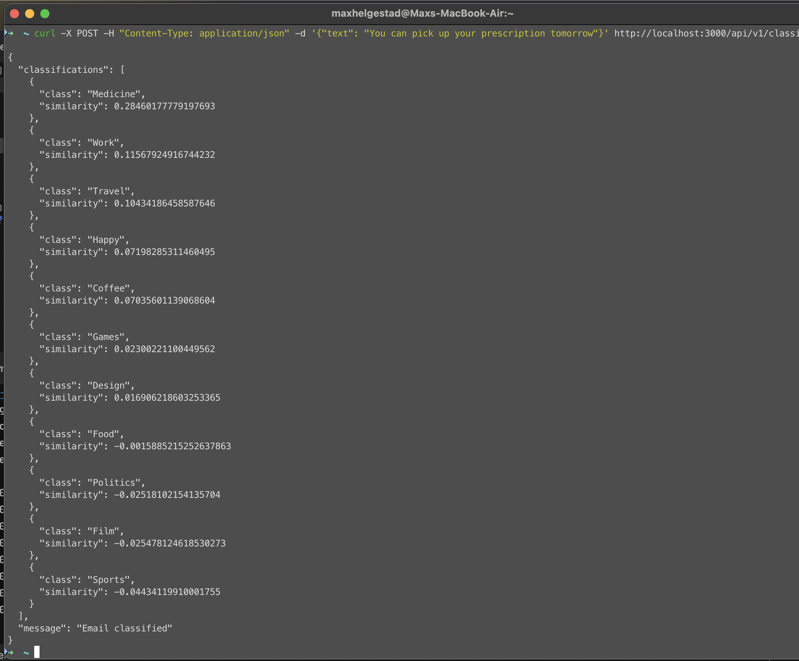
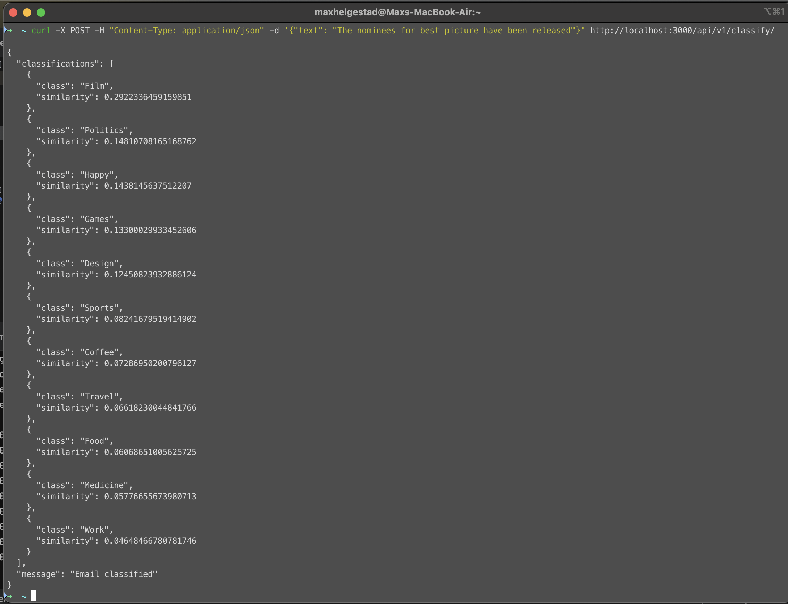

## Code
### loading class file at app startup
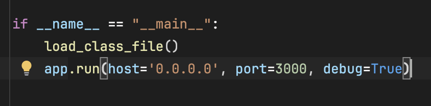
### `load_class_file` function code in `analyze.py`
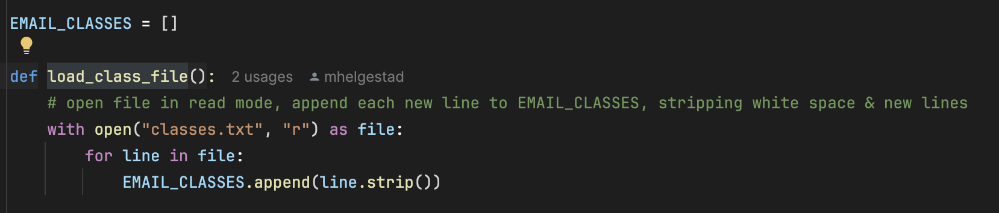
### `/add-classes` and `/classes` endpoint code in `app.py`
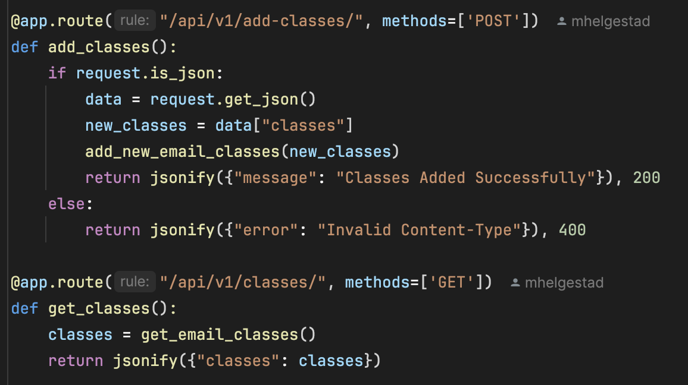
### `get_email_classes` and `add_new_email_classes` code in `analyze.py`
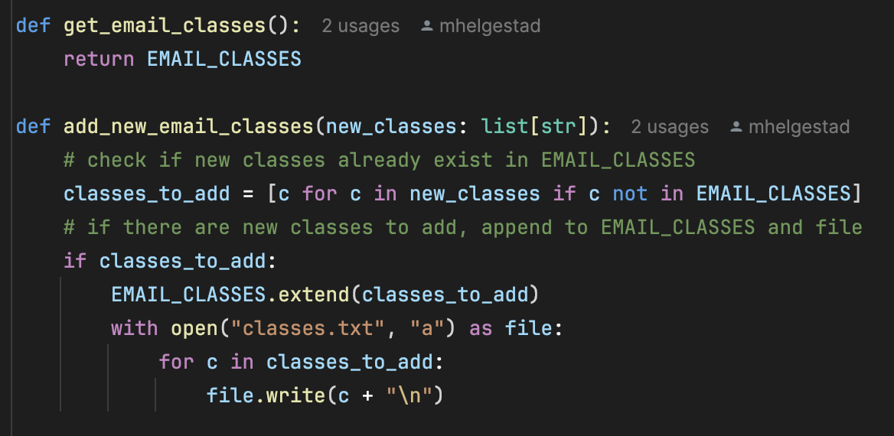